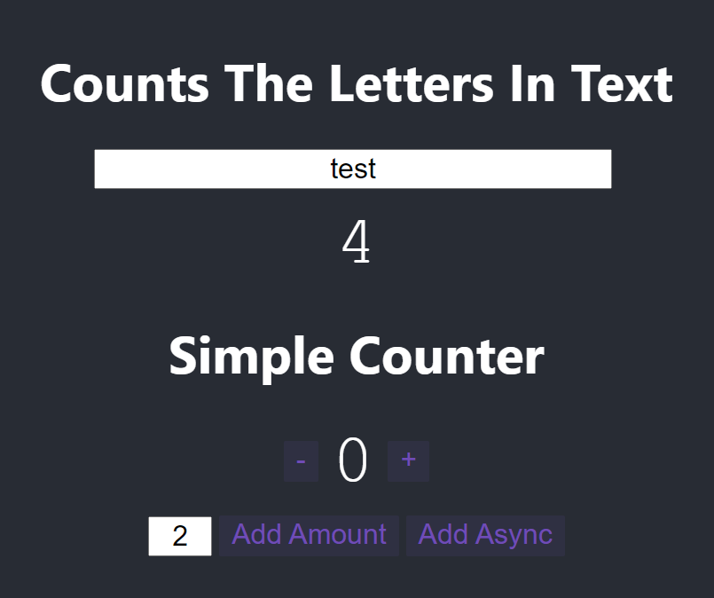

# 📐 SMIS Design Pattern

    

The project is to explain steps of demonstrate how to implement the **[SMIS Design Pattern](https://medium.com/@m.a.faried/smis-design-pattern-d725a7ad814c)** and show how beneficial it is when the deverlopers need to shift between global state providers. The design pattern purpose is to abstract the usage of global state manager in order to decreate the amount of changes required when this shift happens.

 

> 👉 You can find the full explanation of SMIS Design Pattern in this Medium article: **[SMIS Design Pattern](https://medium.com/@m.a.faried/smis-design-pattern-d725a7ad814c)**

 

## 👓 App Preview

    

>**Disclaimer:** The application is built on top of the Sand Box provided by Redux in this link [Redux Quick Start Guide](https://redux-toolkit.js.org/tutorials/quick-start) and used only for demonstration of the design pattern.

 

## 🚀 Running The Application
* Open a terminal window and cd at any of the folders and run "npm install" to install the dependencies of the phase.
* Run the application using "npm run start" to get the React app running.

 

## 🔬 Switching Between Redux & React Query

If you are in the final project "phase-3" and want to switch between the two state managers, open the file in the path "phase-3\src\appState\config.js" and change the value of CounterStateManager to either of the 2 state managers.

 

## 💻 Technologies, Patterns, & Packages
* React
* SMIS Design Pattern
* ContextAPI
* Redux & Redux Tool Kit

 

## 💳 Contact Me:
You can send me an email on **m.a.faried@gmail.com** or chat with me on my **[LinkedIn](https://www.linkedin.com/in/mo-faried-0258a445/)** profile.